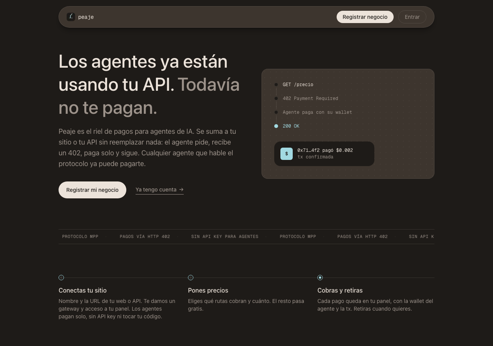

<p align="center">
  
</p>

# Peaje

**Ponle un peaje a tu web y haz que los agentes de IA te descubran, te usen y te paguen.**

Track: 🔑 Access · Team 33 · Platanus Hack 26 Bogotá

- Sandra Carrillo ([@sandragcarrillo](https://github.com/sandragcarrillo))
- Carla Martínez ([@carlaupgrade](https://github.com/carlaupgrade))
- Angela Ocando ([@ocandocrypto](https://github.com/ocandocrypto))

## Qué es

Cualquier negocio con una URL registra su web con su email, le pone precio a sus links (o importa su sitemap), y obtiene un gateway que cobra por request a agentes de IA vía **MPP** (HTTP 402, el estándar de Tempo + Stripe). El agente paga solo en stablecoin (tarjetas vía Stripe en el roadmap del protocolo); el dueño ve el revenue entrar en su dashboard. Además, Peaje hace el sitio descubrible: score de agent-readiness (Ora), kit de archivos para agentes y MCP server con tools pagas por negocio. Sin código de pagos, sin tocar crypto en el onboarding.

**Demo:** [peaje-dashboard.vercel.app](https://peaje-dashboard.vercel.app) · Gateway: `peaje-gateway.up.railway.app`

```bash
# crea una wallet efímera, la fondea en testnet, y paga de verdad por cada
# endpoint pago del tenant (ej. el clima de Bogotá a $0.02) — sin cuenta previa
npx mppx@latest validate https://peaje-gateway.up.railway.app/clima-andino
```

## Arquitectura

```
[Agente] ──HTTP/MCP──> [Gateway Hono + mppx · Railway] ──proxy──> [Web/API del negocio]
                          │  402 → pago on-chain (Tempo) → receipt
                          └─ Ledger (Supabase) acredita por tenant
[Dashboard Next.js · Vercel] ── onboarding por email (Privy, wallet automática),
                                 score Ora, precios · retiros: feature disponible pronto
```

| Pieza | Qué hace |
|---|---|
| `apps/gateway` | Multi-tenant: `/{slug}/*` cobra por MPP y hace proxy. MCP con tools pagas en `/{slug}/mcp`. Discovery (`openapi.json`, `llms.txt`, `.well-known/*`) generado de la DB. Retiros desde la treasury — feature disponible pronto en el dashboard. |
| `apps/dashboard` | Registro por email (Privy, wallet automática), score de agent-readiness (Ora) con previsión, links con precio + importar sitemap, kit agent-ready con verificador. |
| `packages/db` | Esquema y stores (Supabase / memoria). |

## Correr local

```bash
pnpm install
cp .env.example .env   # completar credenciales
pnpm --filter @peaje/gateway dev      # :8787
pnpm --filter @peaje/dashboard dev    # :3100
```

Probar el ciclo de pago: `npx mppx validate http://localhost:8787/<slug>`

## Estado

- `mppx validate` contra producción: 90 checks, 0 fallos
- Pagos reales en Tempo testnet (pathUSD), verificables en [explore.testnet.tempo.xyz](https://explore.testnet.tempo.xyz)
- Retiros: la API del gateway y la lógica de treasury ya funcionan, probado con transacciones reales — feature disponible pronto en el dashboard
- Plan y specs en [docs/PLAN.md](./docs/PLAN.md)
